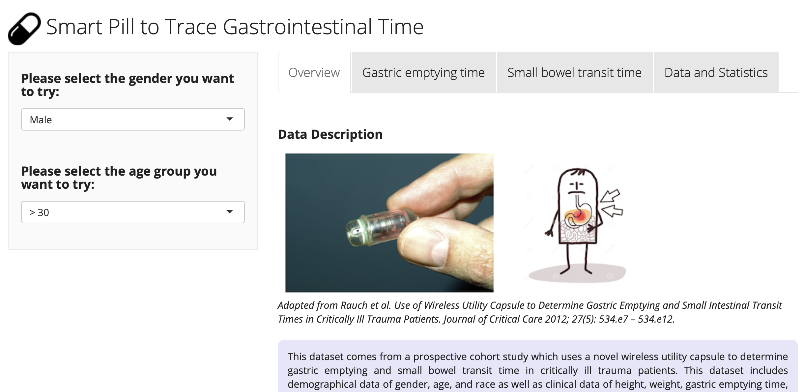
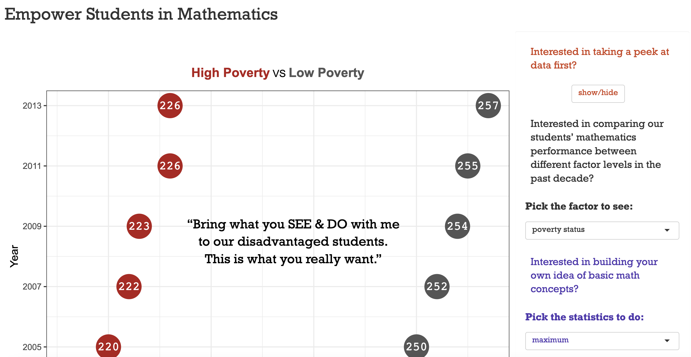

# RShinyApps
This repository presents my past R shiny applications developed for research and educational purposes.

**[Examine Selection upon Substitutions in Mitochondrial Genomics](https://anniliu.shinyapps.io/SelectMito/)**

{SelectMito} helps you to examine the presence of selection upon synonymous or non-synonymous substitutions.

 

**[Smart Pill to Trace Gastrointestinal Time](https://anniliu.shinyapps.io/smartpill/)**

{SmartPill} helps you to explore the relationship between gastrointestinal time and body mass index between critically ill trauma patients and healthy volunteers and to view the underlying dataset.

**[Empower Students in Mathematics](https://anniliu.shinyapps.io/math/)**

{EmpowerMath} helps you to understand what factors drive the divergent mathematics scores among students and asks viewers to build their own understandings of basic mathematical concepts by doing mathematics with the App.

