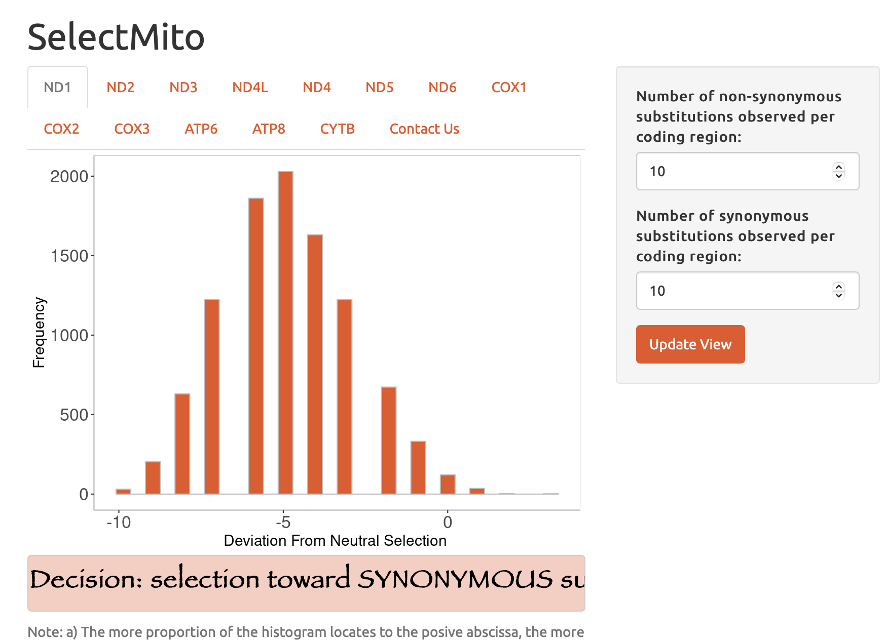

# RShinyApps
This repository presents my past R shiny applications developed for research and educational purposes.

**[Examine Selection upon Substitutions in Mitochondrial Genomics](https://anniliu.shinyapps.io/SelectMito/)**

**[Smart Pill to Trace Gastrointestinal Time](https://anniliu.shinyapps.io/smartpill/)**

**[Empower Students in Mathematics](https://anniliu.shinyapps.io/math/)**

